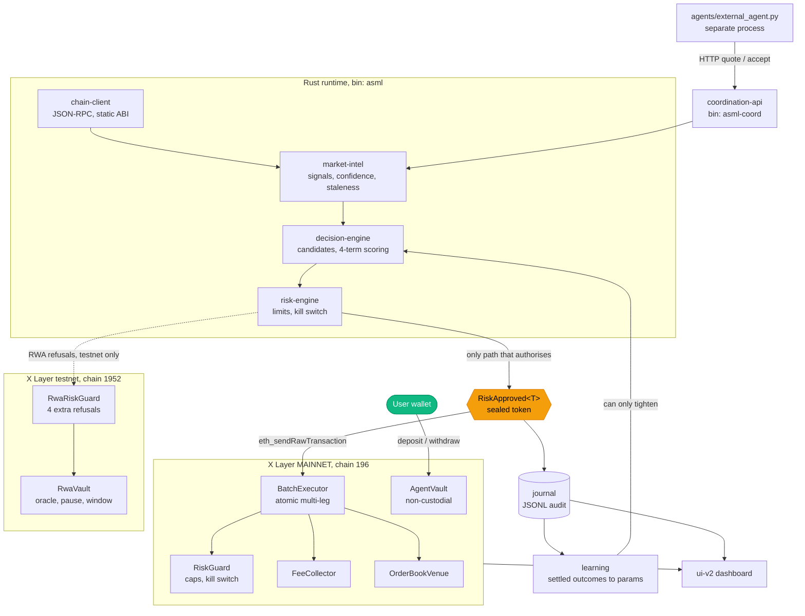

# ASML-X

**Deposit money. An agent trades it under limits only you can tighten. Withdraw whenever you
want, including while the agent is paused.**

That is the product. It is live on **X Layer mainnet, chain 196, with real OKB** — deposit,
an agent action under a user-set limit, a fee event, and a full withdrawal, all executed
onchain `[C-1204]`. Developed against testnet 1952.

Three properties make it safe to actually use, and each is proved rather than promised:

- **Your limit can only tighten, never widen.** `Limits::tightened_by` takes the minimum of
  each field, so a user limit cannot loosen a system limit even if the caller asks it to.
- **Pause can never block withdrawal.** Proved as an invariant over a 128-run campaign, and
  the campaign is shown able to fail `[C-1401]`.
- **The agent cannot bypass the risk gate.** Forging an approval fails to *compile*:
  `RiskApproved<T>` is sealed, and the same cap is independently enforced onchain `[C-1400]`.

Underneath, it reads a real order book over JSON-RPC, forms a thesis from measured signals,
scores a generated candidate set, puts every candidate through that gate, submits multi-leg
transactions atomically, and learns from realized outcomes. There is a second layer of
refusals specific to RWA-linked instruments, and a coordination API other agents can call
([protocol v1.0.0](docs/COORDINATION-PROTOCOL.md)).

**It is not profitable, and that is measured rather than merely unmeasured:** the signal's
hit rate is 40% on n = 10, worse than a coin flip, and the learner responded by cutting its
weight until the agent stopped trading `[C-1406]`. That number is on the landing page in the
loss colour, not in a footnote.

Submission for the BuildX AI Season hackathon (X Layer).

Start here if you are judging: **[JUDGE-GUIDE.md](JUDGE-GUIDE.md)**, a seven-minute path.

## Evidence labels

Every claim in this repository is tagged. `DEMONSTRATED` means shown true with a link to
the artifact. `INFERRED` means assumed from structure and not proven. Untagged claims are
treated as defects.

Claims carry an inline id like `[C-204]`. Every id resolves to a row in
[evidence/CHAIN-OF-EVIDENCE.md](evidence/CHAIN-OF-EVIDENCE.md) giving the artifact and the exact
command that regenerates it. Re-run every row at once with `bash scripts/44-chain-verify.sh`.
The point of the index is that no sentence here has to be taken on trust: a claim whose command
fails is deleted from this file rather than softened.

## What is real, and what is not

Read this before anything else, because two things in the original plan turned out not to
exist and the project says so rather than working around them quietly.

- **Exchange OS has no developer surface on X Layer testnet.** The official 23-page
  Exchange OS whitepaper contains zero contract addresses and zero occurrences of the word
  "testnet", and the X Layer developer documentation navigation contains zero references to
  Exchange OS, TradeZone, venues, or order books. Establishing that took four independent
  primary probes: [docs/verified/exchangeos-availability.md](docs/verified/exchangeos-availability.md).
  Exchange OS is therefore a labelled `INFERRED` migration target in this project, never a
  claimed integration. The live demo makes no Exchange OS claim at all.
- **The venue and the RWA instrument are ours.** Chain 1952 carries roughly 110 user
  transactions across 7 distinct contracts per 300 blocks, and no Uniswap factory or router
  exists at any canonical address, so there was nothing liquid to integrate against:
  [docs/verified/chain-1952-reality.md](docs/verified/chain-1952-reality.md). We deployed
  our own order book and our own RWA stand-in, both labelled `SELF-DEPLOYED STAND-IN`
  wherever they appear.

What that preserves: every transaction is real, onchain, and verifiable on a public
explorer. What it costs is stated plainly in [docs/limitations.md](docs/limitations.md).

## Architecture

Two chains, one codebase. **Mainnet 196 is where the product runs**; testnet 1952 is where it was
developed and where the RWA layer still lives.



### The money path, and what can stop it

```mermaid
sequenceDiagram
    actor U as User
    participant V as AgentVault
    participant A as Agent (Rust)
    participant R as Risk gate
    participant C as Chain 196

    U->>V: deposit + set MY limit
    Note over V: limit can only ever tighten
    A->>C: read order book
    A->>A: form thesis, score candidates
    A->>R: submit intent
    alt within every limit
        R-->>A: RiskApproved&lt;T&gt;
        A->>C: execute atomically
        C-->>U: fee event + journal row
    else breaches any limit
        R-->>A: REFUSED with the numbers
        Note over A,C: nothing reaches the chain
    end
    U->>V: withdraw
    Note over V: works even while the agent is paused
```

## The three design decisions that matter

**1. The agent cannot reach the chain except through the risk gate, and that is enforced by
the type system.** The signing path requires a `RiskApproved<OrderIntent>`, a token whose
only constructor lives inside the risk engine. Writing code that submits an unapproved
order does not fail a test, it fails to compile:
[evidence/bypass-compile-error.txt](evidence/bypass-compile-error.txt) `DEMONSTRATED`.

**2. The risk engine is pure: no floats, no clock reads.** `float_arithmetic` is denied at
the workspace lint level and time is passed in as an argument. Both properties exist so the
limits are formally verifiable, and retrofitting either later would have meant a rewrite.
See [ADR-005](docs/decisions/ADR-005-no-floats-no-clocks.md).

**3. Learning structurally cannot widen a risk limit.** The `Learner` type has no field,
argument, or return type anywhere in its API that mentions `Limits`. It produces scoring
parameters and nothing else, so the guarantee is a fact about which types exist rather than
a policy someone must remember.

## Verification

| gate | result |
|---|---|
| Rust tests | 19 suites, all green `DEMONSTRATED` |
| Solidity tests | 50 Foundry tests including 4 stateful invariant campaigns `DEMONSTRATED` |
| Formal verification | 7 + 7 Halmos theorems, each proven for all inputs in range `DEMONSTRATED` `[C-220]` [evidence/formal/](evidence/formal/) |
| Second prover, independently | 5 hevm 0.57.0 theorems on the same cap invariant, a different engine reaching the same conclusion `DEMONSTRATED` `[C-221]` |
| Runtime assertion, proven to fire | a scribble annotation on the cap: the plain contract accepts 150, the instrumented one reverts `DEMONSTRATED` `[C-222]` |
| Proof mutation | an injected 1-wei cap violation and a removed pause refusal were both caught `DEMONSTRATED` `[C-220]` |
| Automated mutation, risk engine | cargo-mutants found **37 surviving mutants** in the crate holding every limit check. 11 tests were written to kill them `DEMONSTRATED` `[C-230]` `[C-231]` |
| Mutation: risk engine | 14/14 RED [evidence/mutation-risk-engine.md](evidence/mutation-risk-engine.md) |
| Mutation: contracts | 15/15 RED [evidence/mutation-contracts.md](evidence/mutation-contracts.md) |
| Mutation: RWA layer | 18/18 RED [evidence/mutation-rwa.md](evidence/mutation-rwa.md) |
| Mutation: learning | 12/12 RED [evidence/mutation-learning.md](evidence/mutation-learning.md) |

Every test suite is mutation-tested: the thing each test guards is deliberately broken, the
test is confirmed RED, then restored and confirmed GREEN. A test that cannot fail is
deleted. This caught three cases where a mutation silently failed to apply, which proves
nothing at all, and several where a test was passing vacuously.

Those four gates are hand-written, and running an automated mutation engine over the same crate
showed what hand-written gates miss. `cargo-mutants` generated 107 viable mutants of the risk
engine and **37 survived** the full suite: no test pinned a single limit boundary (so `>` could
become `>=` everywhere unnoticed), no test used a book with existing exposure (so the post-trade
projection that stops a book creeping past a limit one order at a time was never exercised), the
shipped default limits were asserted nowhere, and `is_halted` had no test at all. The 14/14 RED
table above was true and incomplete at the same time: a hand-written gate tests the breaks its
author thought of. Eleven tests were added to kill those 37, and the before-and-after survivor
lists are both in the evidence `[C-230]` `[C-231]`.

Formal verification uses [Halmos](https://github.com/a16z/halmos) rather than the Certora
Prover. See [ADR-007](docs/decisions/ADR-007-formal-verification-tool.md) for why.

### Continuous integration

[`.github/workflows/ci.yml`](.github/workflows/ci.yml). Seven jobs, every one able to fail the
build. The runner image, every action and every toolchain is pinned to an explicit version, because
a pipeline that floats produces a green meaning "it passed against whatever existed that day".

| job | gates |
|---|---|
| `rust` | `cargo fmt --check`, `cargo clippy --all-targets -- -D warnings`, `cargo build`, `cargo test`, all `--locked` |
| `contracts` | `forge build`, `forge test` including the stateful invariant campaigns |
| `formal` | all five halmos theorem scripts |
| `mutation` | vault invariant mutation, crossed-book mutation: each breaks the guarded thing and requires RED |
| `onchain` | **deploy, seed a book, and run a full agent decide-gate-act cycle**, against a local chain |
| `live-chain` | every mainnet claim re-verified read-only against chain 196 |
| `frontend` | `pnpm install --frozen-lockfile`, then `pnpm build` which is `tsc -b && vite build` |
| `browser` | dashboard timing, density, and failure-path recovery in headless Chromium |
| `secrets` | gitleaks over the full history **and** over the working tree, which catch different things |
| `evidence` | chain inventory, claim-tag resolution both directions, chain-of-evidence check |

### The one thing CI does not have, and what replaces it

**The deployer keystore never enters CI.** It holds real OKB on chain 196, and a funded key in
repository secrets is one compromised action away from being drained.

Nothing is skipped for want of it. `scripts/196-ci-anvil-up.sh` starts `anvil` with chain id 1952
and imports its publicly known account 0, which funds nothing on any real network, and
`scripts/lib.sh` reads every endpoint, address and key path from the environment. The **same** gate
scripts then run unmodified: real contract deployments, real transactions, real settlement, real
receipts. What that does not prove is anything about X Layer specifically, since a fresh chain has
no live order flow and none of X Layer's OP Stack predeploys. The mainnet claims rest on what chain
196 records, re-verified read-only by the `live-chain` job, which needs no key at all.

Three gates were nearly declared "local only" and should not have been:

- **The browser audits.** Environment fact E11 says `requestAnimationFrame` and `setTimeout` do not
  fire when this project's own agent preview pane is closed. That is a property of that pane, not of
  headless browsers. Chromium runs both, and the audits now run in CI unmodified.
- **The live-RPC gates.** "It might fail on someone else's outage" is a weak reason not to test. The
  job retries three times; a persistent failure still fails the build.
- **Three halmos scripts** passing `--solver-timeout-assertion 0`, which is unlimited. That was a
  two-line fix per script, not a reason for exclusion.

## Deployed contracts, chain 1952

| contract | address |
|---|---|
| OrderBookVenue | [`0x7092050F3C4e72A2df8610ae2CC8c39DcA3B7f52`](https://www.oklink.com/x-layer-testnet/address/0x7092050F3C4e72A2df8610ae2CC8c39DcA3B7f52) |
| RiskGuard | [`0xE64b6e937Fd0d855161A5F6F0Aa1A3E01CB54c24`](https://www.oklink.com/x-layer-testnet/address/0xE64b6e937Fd0d855161A5F6F0Aa1A3E01CB54c24) |
| BatchExecutor | [`0x81beCFdE5ad4692Dc52F7eA6B9DEA0C5f1694d5e`](https://www.oklink.com/x-layer-testnet/address/0x81beCFdE5ad4692Dc52F7eA6B9DEA0C5f1694d5e) |
| RwaVault `SELF-DEPLOYED STAND-IN` | [`0x3BF12df3BB0b6f0dF8c57089ab78e402bf698F84`](https://www.oklink.com/x-layer-testnet/address/0x3BF12df3BB0b6f0dF8c57089ab78e402bf698F84) |
| RwaRiskGuard | [`0x401Ef3E4b9b838A021109c3BBebb7FDC70Cb9278`](https://www.oklink.com/x-layer-testnet/address/0x401Ef3E4b9b838A021109c3BBebb7FDC70Cb9278) |
| tBASE, tQUOTE test tokens | [`0x9D22e5...43C9`](https://www.oklink.com/x-layer-testnet/address/0x9D22e538a72a5d2c9A28D08c27999216A78343C9), [`0x7ff884...Fa0D`](https://www.oklink.com/x-layer-testnet/address/0x7ff884C412a1A2c416e931C59889e5335C5EFa0D) |

Agent-driven transactions, submitted by the runtime rather than by a script:
[`0xbed1a412`](https://www.oklink.com/x-layer-testnet/tx/0xbed1a412229db6557645a893e3465e821d5622872c8ebef8cffce3eaede80a5d),
[`0x03609244`](https://www.oklink.com/x-layer-testnet/tx/0x03609244f14d3bd14db73e46f0205ef595a9214d7af30399b090748f5ccd965f),
[`0x34bf908d`](https://www.oklink.com/x-layer-testnet/tx/0x34bf908d4fc3e23cb1be655bd47a32c6b11e4945827fcad4552ecdbd7fd7ccab)
`DEMONSTRATED` `[C-211]`.

Every address above returns non-empty bytecode on the live chain, and every transaction hash
cited anywhere in this repository resolves with status `0x1`. Both are re-checked from chain, not
from these tables: `bash scripts/67-verify-deployments.sh` and
`bash scripts/68-verify-tx-claims.sh` `[C-204]` `[C-211]`.

## Measured numbers

All measured on chain 1952, not taken from marketing material.

| metric | value |
|---|---|
| chain id | 1952 (chain 195 is deprecated and still answers, which is a trap) `[C-202]` |
| block time | 1.000 s, measured over 300 blocks `[C-203]` |
| gas limit | 210,000,000 |
| gas price | 20,000,001 wei |
| gas per agent action | 45,366 for the Ping proof, higher for multi-leg batches |
| candidates evaluated per decision | 11 to 27, generated from the live book |
| total cost of the entire build | under 0.001 OKB |
| connect to running, cold start | 8.6 s median of 3 runs, first paint to activated. **SCRIPTED, not human**: a lower bound, because a script does not hesitate and a person does `[C-1001]` |
| of which, waiting for the chain | about 4.8 s. The part the product controls is about 3.8 s |
| deposit and activate | 3 interactions from a cold wallet: one click, one signature, one confirmation `[C-903]` |

## Run it in ten minutes

Requires WSL or Linux. Foundry and Rust install from prebuilt binaries, no Docker.

```bash
# 1. toolchains
curl -L https://foundry.paradigm.xyz | bash && foundryup
curl --proto '=https' --tlsv1.2 -sSf https://sh.rustup.rs | sh -s -- -y

# 2. build
cargo build --release
cd contracts && forge build && cd ..

# 3. tests, no chain needed
cargo test --workspace
bash scripts/10-contracts-test.sh

# 4. see it decide against the live chain, read-only, no transactions
ASML_REPO=$PWD ./target/release/asml observe 4

# 5. the AI-RWA side-by-side, the most important screen
bash scripts/24-side-by-side.sh

# 6. the dashboard
bash scripts/35-serve-ui.sh     # http://127.0.0.1:8080/ui/
```

Submitting transactions needs a funded keystore. Generate one with
`bash scripts/gen-deployer-wallet.sh`, fund the printed address from the X Layer testnet
faucet, then use `asml run <cycles>`.

## Invariants proven for all inputs

From [docs/invariants.md](docs/invariants.md) and the RWA symbolic suite:

1. No action can push per-market exposure above its cap.
2. No action can push gross exposure above the global cap.
3. Once the kill switch is set, every guarded call reverts.
4. The agent role can never clear the kill switch. Only the owner can.
5. Gross exposure always equals the sum of its per-market parts.
6. A paused RWA issuer refuses new exposure for any amount.
7. De-risking is never blocked by any RWA condition, for any amount.
8. The oracle divergence boundary is exact.
9. The RWA yield index can never decrease.
10. No caller other than the owner can loosen the RWA policy.

Property 7 is the one that matters most. A stale oracle or a paused issuer is exactly when
an agent most needs to exit, and a guard that blocks the exit turns a risk control into the
risk. It is proven symbolically, unit-tested, and demonstrated live onchain.

## Honest limitations

[docs/limitations.md](docs/limitations.md) is not a formality. The four biggest:

1. Exchange OS integration is not demonstrated, because no testnet surface exists.
2. The venue and RWA instrument are self-deployed, so their realism is bounded by what we
   wrote.
3. The coordination server stalls under a rapid burst, so its rate limiter has never been
   observed tripping. The remedy is known and stated.
4. There is no realized PnL anywhere in this project, so nothing here supports any claim
   about profitability.

## Repository layout

```
crates/          Rust workspace: 12 crates, 2 of them offline probes not on the product path
contracts/       Solidity + Foundry: 7 contracts, 49 tests, symbolic suites
scripts/         every operation, numbered, runnable
agents/          external_agent.py, the separate-process coordination client
ui/              single-file dashboard, plus nodata-check/ proving it cannot fake data
ui-v2/           the terminal-density rebuild, toolchain only until the UI study lands
evidence/        tx hashes, mutation tables, proof reports, gate reports per phase
evidence/CHAIN-OF-EVIDENCE.md   the claim index every [C-xxx] tag in this file resolves to
docs/verified/   facts established from primary sources, with retrieval dates
docs/decisions/  ADR-001 to ADR-012
```

Internal working notes are gitignored and not part of the submission.

## License

MIT.
