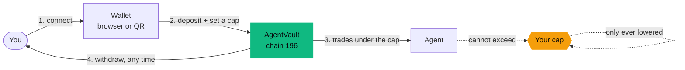
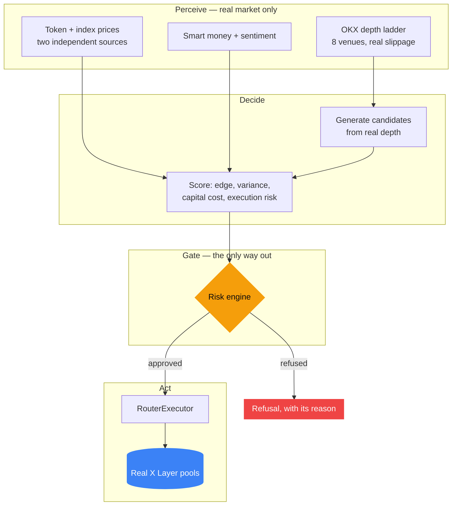
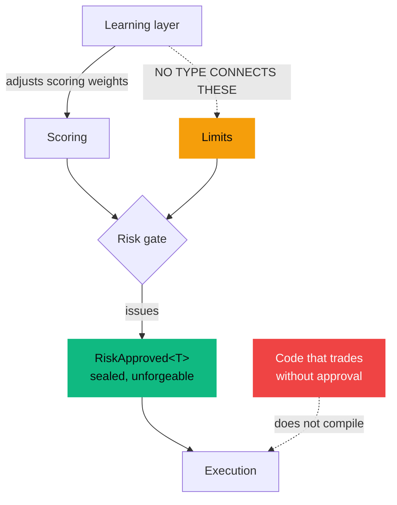
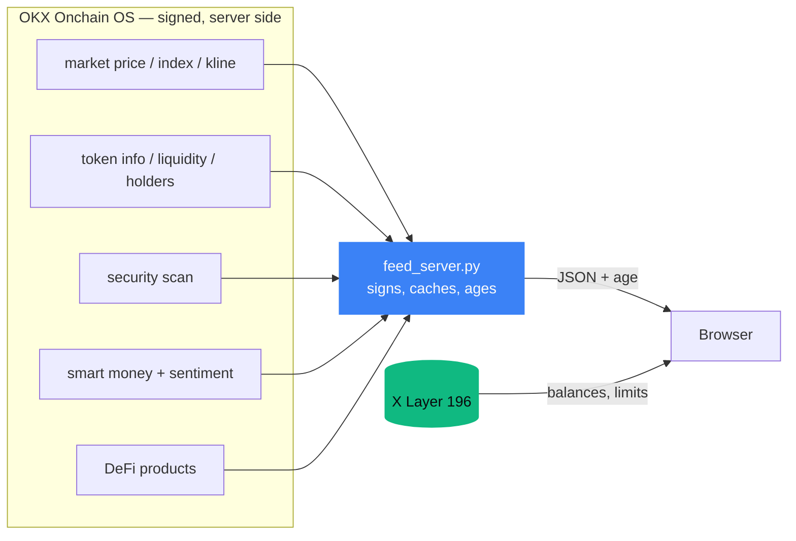
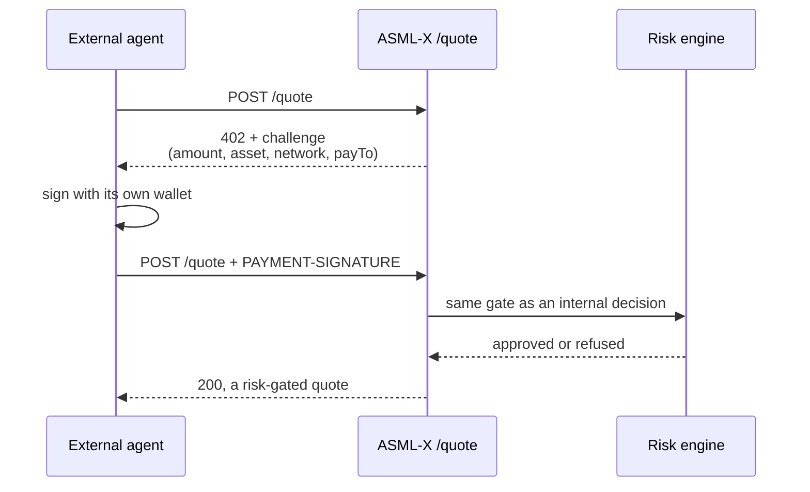

# ASML-X architecture

An AI agent that trades real tokens on X Layer and cannot exceed the limit you set.

Every diagram below describes what is deployed and running, not a plan.

---

## What a person does

The cap is stored on chain. Raising it is not difficult, it is impossible: `RiskGuard` has no
code path that increases a limit, and withdrawal is not gated on the agent being healthy.

---

## The decision loop

96% of considered trades are refused. That is the system working, not failing.

---

## Why the agent cannot cheat

Three structural guarantees, each proved rather than asserted:

| Guarantee | How it is enforced | Proof |
|---|---|---|
| Limits only tighten | `RiskGuard` has no widening path | Halmos symbolic execution |
| Learning cannot widen limits | `Learner` has no type mentioning `Limits` | Compile-time |
| Agent cannot skip the gate | `RiskApproved<T>` is sealed in `risk-engine` | Fails to compile |
| Pause never blocks withdrawal | Withdrawal is not gated on agent state | Halmos |

---

## Where the data comes from

The browser never holds the API secret. Signing happens server-side; the page receives results
with the age of each one attached, so nothing is presented as live that is not.

---

## Agent-to-agent payments

Payment buys the quote. It does not buy a larger one: the risk gate runs identically whether or
not payment was made.

---

## Deployed on X Layer mainnet, chain 196

| Contract | Role |
|---|---|
| `AgentVault` | Holds deposits. Withdrawal works while paused |
| `RiskGuard` | On-chain limits. Only ever tighten |
| `RouterExecutor` | Routes swaps through OKX, verifies the balance delta, reverts on shortfall |
| `BatchExecutor` | Submits approved actions, and only approved actions |
| `RwaVault` / `RwaRiskGuard` | RWA-specific refusals, including the price-divergence band |
| `FeeCollector` | Usage fee, capped at 100 bps by the contract |

Addresses are in the app footer, each linked to the public explorer.
